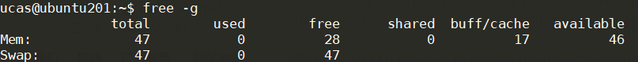
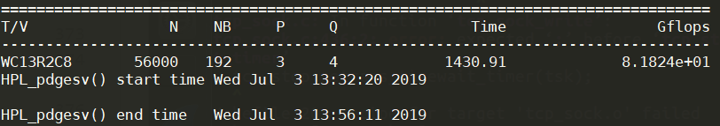

Linpack测试：配置、安装及参数优化
===

------

实验内容
---

- 深入了解Linpack算法

- 运行HPL测试，优化参数，提高性能

  

Linpack介绍
---

- Linpack全称为**线性系统包**(Linear System Package)，是国际上用于测试计算机系统浮点性能的Benchmark。它通过对高性能计算机进行求解N元一次稠密线性方程组的方式，，测试计算机的浮点性能。

- Linpack测试分为三类：Linpack100、Linpack1000和HPL (High Performance Linpack)
  - Linpack100 求解规模为100阶的稠密线性代数方程组，它只允许采用编译优化选项进行优化，不得更改代码，甚至代码中的注释也不得修改。
  - Linpack1000 求解规模为1000阶的线性代数方程组，达到指定的精度要求，可以在不改变计算量的前提下做算法和代码上做优化。
  - HPL也叫高度并行计算基准测试，它对数组大小N没有限制，求解问题的规模可以改变，除基本算法（计算量）不可改变外，可以采用其它任何优化方法。前两种测试运行规模较小，不太适合现代计算机。
  
- HPL是针对现代并行计算机提出的测试方式。用户在不修改任意测试程序的基础上，可以调节问题规模大小(矩阵大小)、使用CPU数目、使用各种优化方法等等来执行该测试程序，以获取最佳的性能。

- HPL采用高斯消元法求解线性方程组。求解问题规模为N时，浮点运算次数为$$\frac{2}{3} N^{3}+\frac{3}{2} N^{2}$$。给出问题规模$$N$$，测得系统计算时间$$T$$，$$峰值=\frac{\frac{2}{3} N^{3}+\frac{3}{2} N^{2}}T (FLOPS)$$。

  

实验环境
---

- 本次实验环境是中科院计算所曙光服务器，Ubuntu16.04系统，硬件环境如下：

  ```xterm
  Architecture:          x86_64
  CPU op-mode(s):        32-bit, 64-bit
  Byte Order:            Little Endian
  CPU(s):                24
  On-line CPU(s) list:   0-23
  Thread(s) per core:    2
  Core(s) per socket:    6
  Socket(s):             2
  NUMA node(s):          2
  Vendor ID:             GenuineIntel
  CPU family:            6
  Model:                 62
  Model name:            Intel(R) Xeon(R) CPU E5-2620 v2 @ 2.10GHz
  Stepping:              4
  CPU MHz:               1200.347
  CPU max MHz:           2600.0000
  CPU min MHz:           1200.0000
  BogoMIPS:              4200.02
  Virtualization:        VT-x
  L1d cache:             32K
  L1i cache:             32K
  L2 cache:              256K
  L3 cache:              15360K
  NUMA node0 CPU(s):     0-5,12-17
  NUMA node1 CPU(s):     6-11,18-23
  ```

- 机器有2个sockets，每个socket有6个核，因此该机器最多支持同时运行12个进程。

- 理论浮点运行峰值 = CPU主频 × CPU核心数 × 每周期浮点运算次数。CPU主频为2.10GHz，CPU核心数为6，Intel Xeon E5-2620 v2的单周期浮点运算次数为8，故理论运行峰值为 $$2.10GHz  \times 6 \times  8 = 100.8 Gflops$$。


安装HPL
---

 **HPL环境搭建**：在安装HPL之前，需要安装MPI与BLAS库(这一步已经由助教帮助完成)。

1. 在官网<http://www.netlib.org/benchmark/hpl/>下载安装包`hpl-2.3.tar.gz`，解压。

2. 将`hpl-2.3/setup/`文件夹中的`Make.Linux_PII_FBLAS`文件拷贝到上层目录，并且命名为`Make.<arch>`，其中`<arch>`为任意后缀，本实验中`<arch>=ZY`。

3. 对`Make.<arch>`进行如下配置：

   ```
   ARCH         = ZY
   
   TOPdir       = $(HOME)/hpl-2.3
   INCdir       = $(TOPdir)/include
   BINdir       = $(TOPdir)/bin/$(ARCH)
   LIBdir       = $(TOPdir)/lib/$(ARCH)
   #
   HPLlib       = $(LIBdir)/libhpl.a
   
   MPdir        = /opt/pgi/linux86-64/19.4/mpi/openmpi-3.1.3
   MPinc        = -I$(MPdir)/include
   MPlib        = -L$(MPdir)/lib -Wl,-rpath=$(MPdir)/lib -lmpi
   
   LAdir        = /home/ucas/OpenBLAS-0.3.6
   LAinc        =
   LAlib        = $(LAdir)/libopenblas.a
   
   LAdir        = /home/ucas/BLAS-3.8.0
   LAinc        =
   LAlib        =$(LAdir)/libblas.so
   
   LINKER       = mpicc
   LINKFLAGS    = $(CCFLAGS)
   ```

   配置完毕后，保存退出。

4. 在安装目录内运行`make arch=<arch>`。如果`hpl-2.3/bin/`中新增名为`<arch>`的文件夹，文件夹内有`HPL.dat`和`xhpl`文件，说明安装成功。

5. 进入`hpl-2.3/bin/ZY`文件夹，运行`mpirun -np 4 ./xhpl`，即可运行HPL测试。


HPL参数
---

HPL的参数位于`HPL.dat`中，如下：

```powershell
  1 HPLinpack benchmark input file
  2 Innovative Computing Laboratory, University of Tennessee
  3 HPL.out      output file name (if any)
  4 6            device out (6=stdout,7=stderr,file)
  5 1            # of problems sizes (N)
  6 40000        Ns
  7 1            # of NBs
  8 48          NBs
  9 1            PMAP process mapping (0=Row-,1=Column-major)
 10 1            # of process grids (P x Q)
 11 2            Ps
 12 6            Qs
 13 16.0         threshold
 14 1            # of panel fact
 15 1            PFACTs (0=left, 1=Crout, 2=Right)
 16 1            # of recursive stopping criterium
 17 8            NBMINs (>= 1)
 18 1            # of panels in recursion
 19 2            NDIVs
 20 1            # of recursive panel fact.
 21 2            RFACTs (0=left, 1=Crout, 2=Right)
 22 1            # of broadcast
 23 3            BCASTs (0=1rg,1=1rM,2=2rg,3=2rM,4=Lng,5=LnM)
 24 1            # of lookahead depth
 25 1            DEPTHs (>=0)
 26 2            SWAP (0=bin-exch,1=long,2=mix)
 27 64           swapping threshold
 28 0            L1 in (0=transposed,1=no-transposed) form
 29 1            U  in (0=transposed,1=no-transposed) form
 30 1            Equilibration (0=no,1=yes)
 31 8            memory alignment in double (> 0)
```

参数的说明如下：

| 行号  |                   参数说明                   |
| :---: | :------------------------------------------: |
|  1~2  |             说明性文字，无需修改             |
|  3~4  |            用作保存测试结果的设置            |
|   5   |              选择测试矩阵的数量              |
|   6   |              矩阵的规模（阶数）              |
|   7   |                矩阵分块的数量                |
|   8   |            矩阵分块的规模（阶数）            |
|   9   |         处理器阵列按列排列或按行排列         |
|  10   |             二位处理器网格的数量             |
| 11~12 |             每个网格的行数和列数             |
|  13   |             测试的精度，无需修改             |
| 14~21 |               LU分解的算法选择               |
| 22~23 |             L的横向广播算法选择              |
| 24~25 |      横向通信的通信深度，一般为0、1、2       |
| 26~27 |             U的列项广播算法选择              |
| 28~29 | L和U的数据存放格式，0为按列存放，1为按行存放 |
|  30   |          回代中使用，一般使用默认值          |
|  31   |          用于内存地址对齐，一般为8           |
|       |                                              |

HPL参数优化
---

### (1) 矩阵的规模N

矩阵的规模N越大，有效计算所占比例越大，系统浮点处理性能越高；同时，矩阵规模N的增加会导致内存消耗量的增加，如果系统实际内存空间不足，使用缓存，性能反而降低。因此，应该在不使用系统缓存的情况下，尽量增大N。

除去机器固有的一些内存开销，一般矩阵运算占用系统总内存的80%左右为佳，即

$$N \times N \times 8 = 总内存 \times 80\%$$ ，内存总量换算为字节。

机器的内存占用如下所示：



内存总量为47G，初步得 N = 52900，应该在 N ≤ 52900 的范围内进行测试。

### (2) 二维处理器网格 P × Q

P × Q = 进程数 = 系统CPU数。本次实验环境最多支持12个进程。

一般情况下，应使 P 略小于 Q，因为列向通信量的通信次数和通信数据量大于横向通信。另外，由于L分解的列向通信采用二元交换法（Binary Exchange），当列向处理器个数P为2的幂时，性能最优。

### (3) 矩阵分块NB

HPL 使用块大小 NB 进行数据分布和计算粒度。从数据分布的角度来看，NB越小，负载平衡越好。从计算的角度来看，NB 值太小可能会限制计算性能，消息的数量将增加。NB的选择和软硬件许多因素密切相关。

NB一般在256以下，NB的最优值主要通过实际测试来得到。本实验中选取2，4，16，48，128等。

### (4) 其他参数

##### PMAP process mapping (0=Row-,1=Column-major)  

HPL文档中介绍，按列的排列方式适用于节点数较多、每个节点内CPU数较少的系统；按行的排列方式适用于节点数较少、每个节点内CPU数较多的大规模系统。在机群系统上，按列的排列方式的性能远好于按行的排列方式，此处一般选择1。

##### 14～21行 L分解算法

每次L分解只在一列处理器中完成。在LU分解中，具体的算法很多，一般NDIVs设置为2比，NBMINs设置为4或8。HPL官方文档中的推荐设置为：

```shell
1       # of panel fact  
1       PFACTs (0=left, 1=Crout, 2=Right)  
2       # of recursive stopping criterium  
4 8     NBMINs (>= 1)  
1       # of panels in recursion  
2       NDIVs  
1       # of recursive panel fact.  
2       RFACTs (0=left, 1=Crout, 2=Right) 
```

##### L横向广播算法  BCASTs 

HPL中提供了6种广播方式(0=1rg,1=1rM,2=2rg,3=2rM,4=Lng,5=LnM) ，其中，前4种适合快速网络；后两种采用将数据切割后传送的方式，主要适合于速度较慢的网络。一般在小规模系统中选择0或1，大规模系统选择3。本次实验中选择3。

## 实验结果

本次实验中，改变第14~29行的参数时，结果变化不明显；因此主要优化 N, NB, P, Q参数。

初始时实验中安装的BLAS库性能较低，测得HPL的测试效率只有机器的20%；后来使用性能更高的OpenBlas库后，浮点峰值明显提升，部分运行结果如下：

|   N   |  NB  |  P   |  Q   | Result(Gflops) |
| :---: | :--: | :--: | :--: | :------------: |
| 48000 | 192  |  3   |  4   |    6.93e+01    |
| 50000 | 192  |  3   |  4   |   7.1542e+01   |
| 52900 | 128  |  3   |  4   |   6.5655e+01   |
| 52900 | 192  |  3   |  4   |   6.7576e+01   |
| 53000 | 192  |  3   |  4   |   7.6702e+01   |
| 55000 | 192  |  3   |  4   |   7.9900e+01   |
| 56000 | 192  |  3   |  4   |   8.1824e+01   |

性能最高的参数配置如下：



浮点性能的测试效率为$$\frac{81.824Gflops}{100.8Gflops} \times 100\%=81.2\%$$。


参考资料
---

1. https://en.wikipedia.org/wiki/HPL/ 
2. <http://www.netlib.org/benchmark/hpl/>
3. <https://ark.intel.com/content/www/us/en/ark/products/75789/intel-xeon-processor-e5-2620-v2-15m-cache-2-10-ghz.html>
4. HPL参数优化 . 简书